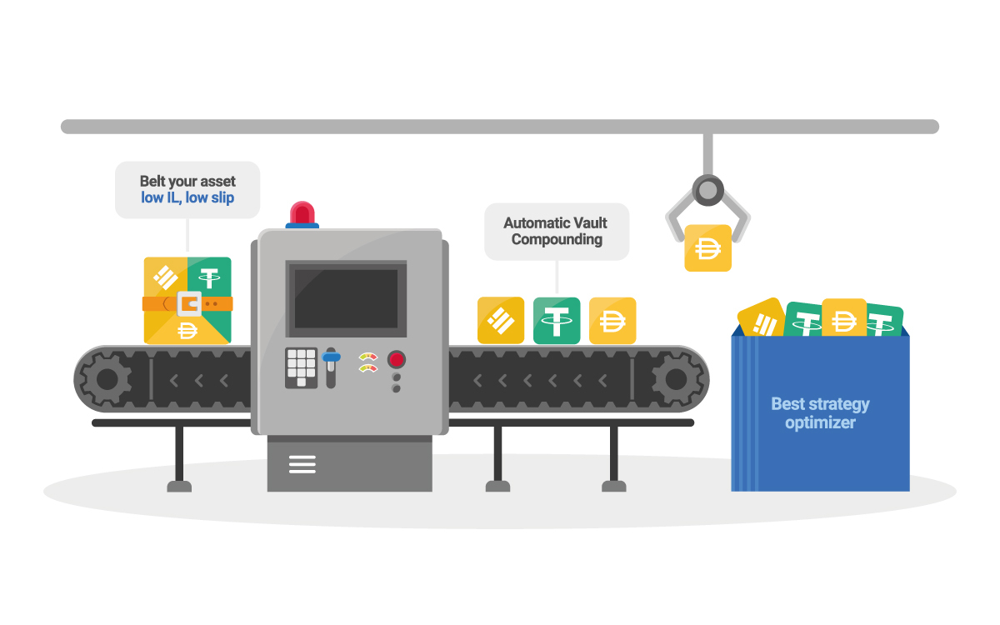

# belt-contract
 

 
https://belt.fi 
 
# Overview

Belt.fi is an AMM protocol that incorporates multi-strategy yield optimizing on Binance Smart Chain (BSC) with low fees/slippage that also provides aggregation through vault compounding, lending and yield generation for maximum returns. 

 

 

# Contract Architecture

 

 
 
- StrategyVenusXXX.sol 

- VaultBPool.sol 

- bToken.sol 

- MasterBelt.sol 

- BeltLPtoken.vy 

- DepositB.vy 

- StableSwapB.vy 

# Audits and Security

Belt.fi smart contracts are all currently undergoing audits. These security audit reports will be opened to the public when completed. 

# License

Copyright (c) 2021, Ozys Pte., Ltd. - All rights reserved. 
