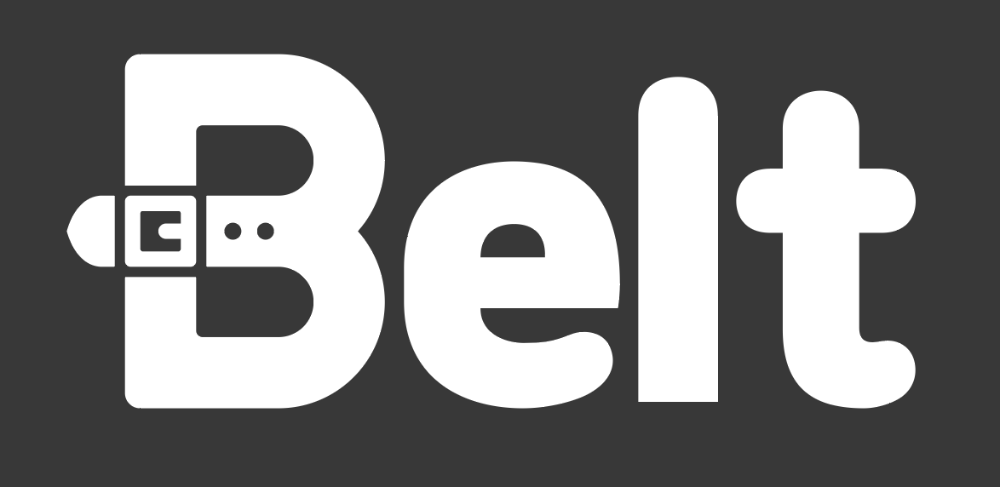
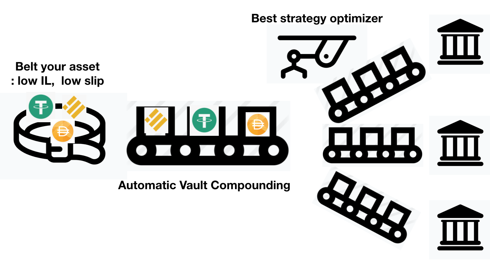
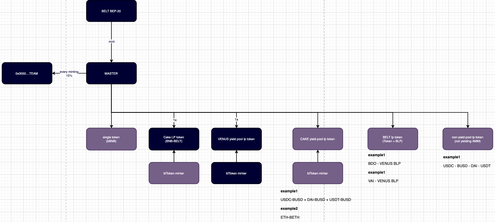

# belt-contract
 
 
 
https://belt.fi 
 
# Overview
 
Belt.fi is an AMM protocol that incorporates multi-strategy yield optimizing on Binance Smart Chain (BSC) with low fees/slippage that also provides aggregation through vault compounding, lending and yield generation for high profits. 
 

 
# Contract Architecture

 

 
- StrategyVenusXXX.sol 

- VaultBPool.sol 

- bToken.sol 

- MasterBelt.sol 

- BeltLPtoken.vy 

- DepositB.vy 

- StableSwapB.vy 

# Audits and Security

Belt.fi smart contracts are all now on auditing processs. These audit reports are open to public when finished.

# License

(c) Belft.Fi, 2021 - All rights reserved.